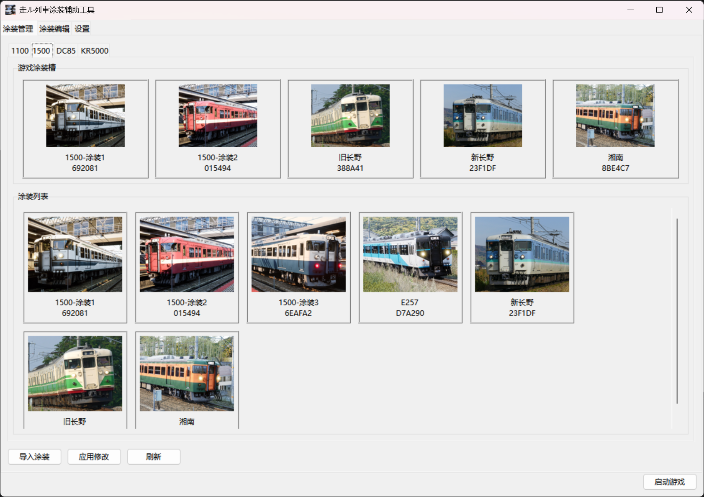

|[中文](https://github.com/Charles-Fan-1025/RTLiveryManager/blob/master/README-zh-cn.md)|[日本語](https://github.com/Charles-Fan-1025/RTLiveryManager/blob/master/README-ja-jp.md)|

# Running Train Livery Manager

A livery management tool for **走ル列車 | Running Train**.



## Features

- Livery Management
  - Manage more than 5 liveries per train model
  - Import, export, edit, and delete liveries
  - Write liveries from the library into game slots
- Livery Editing Assistance
  - Convert the blank livery template provided by the game to the correct aspect ratio, so you can edit it with other tools without worrying about distortion
  - Restore the edited livery file back to its original size

## User Manual

See [User Manual](https://github.com/Charles-Fan-1025/RTLiveryManager/blob/master/manual.md)

## Directory Structure

- `FrontEnd.py`: GUI entry point
- `FileManage.py`: Backend for livery library and game file management
- `ImageProcess.py`: Backend for image processing
- `SteamInteract.py`: Backend for Steam API interaction

## Running the Application

Download the executable directly from [Releases](https://github.com/Charles-Fan-1025/RTLiveryManager/releases), or run with Python (requires Pillow):

Launch the GUI directly:

```powershell
python FrontEnd.py
```

The image processing module also supports command-line invocation. Use python ImageProcess.py -h for help.

## Data Path
The software stores data in `C://Users/<Username>/Documents/RunningTrainLivery/`

## AI Assistance Declearation
This software was developed with the assistance from AI coding tools.
