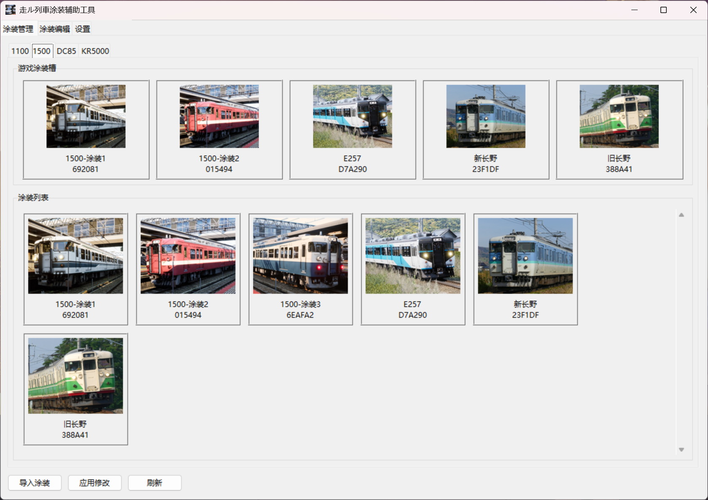

# Running Train Livery Manager

一款用于 `走ル列車 | Running Train` 的材质管理工具。



## 功能

- 涂装管理
  - 管理每个车型多于 5 个的涂装
  - 导入、导出、编辑、删除涂装
  - 将库中的涂装写入游戏槽位
- 涂装编辑辅助功能
  - 将游戏提供的空白涂装文件处理为正确长宽比，从而可以使用其他工具编辑而无需考虑拉伸形变
  - 将编辑完的涂装文件还原为原大小

## 使用说明

见 [使用说明](https://github.com/Charles-Fan-1025/RTLiveryManager/blob/master/manual/manual.md)

## 目录

- `FrontEnd.py`：GUI 入口
- `FileManage.py`：材质库与游戏文件管理后端
- `ImageProcess.py`：图片处理后端

## 运行

从 [Releases](https://github.com/Charles-Fan-1025/RTLiveryManager/releases) 中直接下载可执行文件，或使用 python （依赖 pillow ）：

直接启动 GUI：

```powershell
python FrontEnd.py
```

图片处理模块也支持命令行调用，使用 `python ImageProcess.py -h` 获取帮助。

## 数据路径

软件会把数据存放在 `C://Users/<用户名>/Documents/RunningTrainLivery/`
