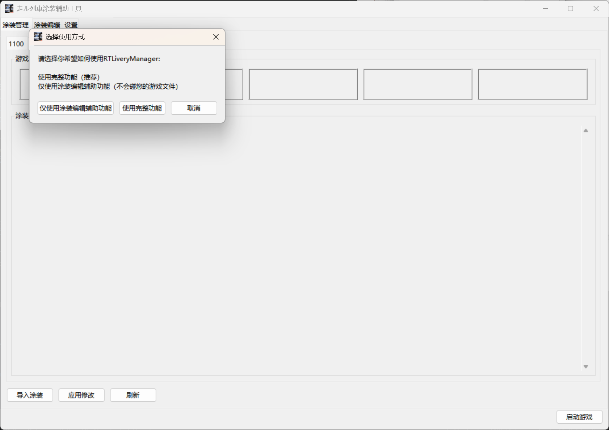
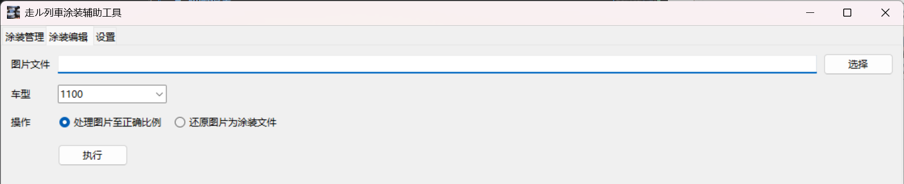
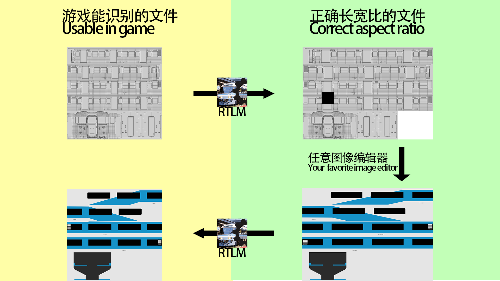
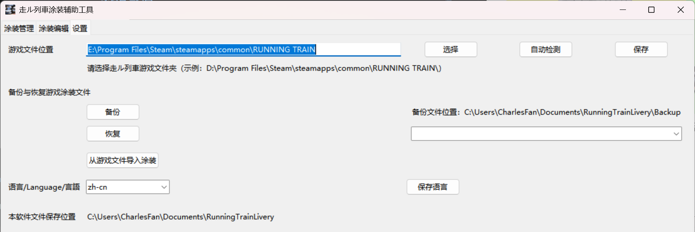

# 初期設定

ソフトウェアを初めて起動すると、使用方法を選択するダイアログが表示されます。

「完全機能を使用する」を選択すると、ソフトウェアが自動的にゲームファイルの場所を検出します。この手順が失敗した場合は、手動でゲームファイルの場所を指定するよう求められます。
ゲームパスは後から「設定」タブでも指定・変更できます。

「完全機能を使用する」を選択した場合、既存の塗装ファイルのバックアップと、ゲームからの塗装インポートを促すプロンプトが表示されます。どちらも「はい」を選択することをお勧めします。

# 塗装管理タブ

このインターフェースは、ゲームの塗装スロットおよび塗装ライブラリを管理するために使用します。
- ゲームスロット内の塗装を`左クリック`すると、そのスロットから塗装が削除されます。
- 塗装リスト内の塗装を`左クリック`すると、空いているゲームスロットにその塗装が装備されます。
- 塗装リスト内の塗装を`右クリック`すると、「エクスポート」「編集」「削除」ができます。

新しい塗装を追加するには、「塗装をインポート」をクリックします。

「名称」「車両形式」「塗装ファイル」は必須項目です。「サムネイル」は省略可能です。

塗装管理が完了したら、「変更を適用」をクリックして、スロット内の塗装をゲームの塗装ファイルに書き込みます。

# 塗装編集補助タブ

このタブでは、ゲームの塗装テンプレートを他のツールで編集しやすいように正しいアスペクト比に変換したり、正しい比率に加工した画像をゲームの塗装ファイル形式に復元したりするのに役立ちます。
ステップバイステップのガイドについては、以下の図解をご覧ください。

「画像を塗装ファイルに復元」を使用する際、ソフトウェアは生成した画像を塗装リストに追加するかどうかを尋ねます。必要に応じて選択してください。

# 設定タブ

ここでは、ゲームファイルのパスを変更したり、ゲーム塗装ファイルのバックアップ・復元を行ったり、ゲームから手動で塗装をインポートしたり、簡体字中国語・英語・日本語（機械翻訳）を切り替えたりすることができます。