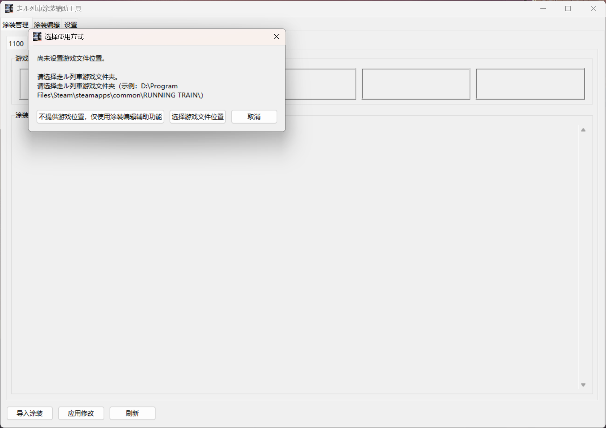
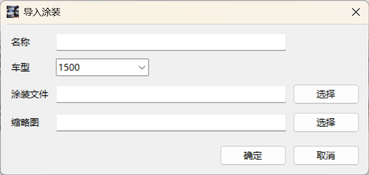
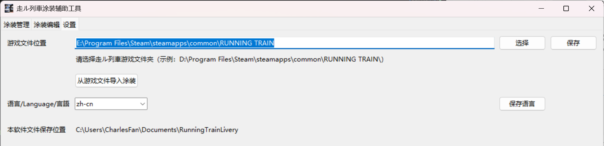

# 初始设置

软件首次启动时，会弹出窗口询问是否指定游戏路径。

您可以选择不提供游戏路径，只使用涂装编辑辅助功能，或提供游戏路径使用完整功能。
提供游戏路径时，请提供在 Steam 库的游戏页面选择 `管理`-`浏览本地文件` 后弹出的文件管理窗口路径。
您可以日后在 `设置` 选项卡中指定 / 更改游戏路径。

如果指定游戏路径，将会弹出弹窗询问是否从游戏导入涂装。建议您选择 `是` 。

# 涂装管理页面

这个界面用于管理游戏涂装槽和涂装列表。
对涂装槽中的涂装 `点击鼠标左键` ，可以将其卸下。
对涂装列表中的涂装 `点击鼠标左键` ，可以将其装备到涂装槽中。
对涂装列表中的涂装 `点击鼠标右键` ，可以将其 `导出`, `编辑` 或 `删除` 。

要添加新涂装，请点击 `导入涂装` 。

`名称` ， `车型` ， `涂装文件` 是必填项。 `缩略图` 可不填。

涂装管理完成后，点击 `应用修改` ，涂装槽中的涂装将被写入游戏涂装文件。

# 涂装编辑辅助页面

这个界面帮助将游戏涂装文件处理至正确的长宽比例，以及将本软件处理的正确长宽比例图片重新转换为游戏涂装文件。
关于如何使用，请看这幅图解：

使用 `还原图片为涂装文件` 时，软件会询问是否将生成的图片添加到涂装列表中，请按需选择。

# 设置页面

在这里修改游戏文件路径、手动从游戏中导入涂装以及在简体中文、英语、日语（机器翻译）中切换语言。